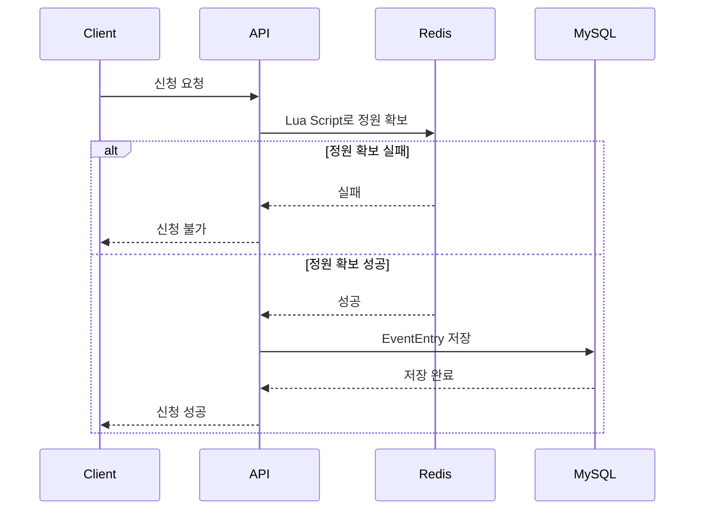

# 선착순

> **200개의 신청 요청이 몰려도, 정확하게 100명만 받을 수 있을까?**

선착순 이벤트에서 발생하는 동시성 문제를 직접 재현하고,  
**Atomic Update / Pessimistic Lock / Optimistic Lock / Redis Lua Script** 전략을 구현하여  
정확성, 성능, 장애 특성을 비교한 백엔드 프로젝트입니다.

단순한 이벤트 CRUD 구현보다 **동시성 제어라는 하나의 문제를 깊게 분석하고 검증하는 것**을 목표로 했습니다.

---

## 핵심 요약

정원이 100명인 이벤트에 200개의 요청이 몰리는 상황을 기준으로 다음 과정을 수행했습니다.

```text
단순 구현
    ↓
Lost Update 재현
    ↓
Atomic / Pessimistic / Optimistic / Redis 구현
    ↓
정확성 검증
    ↓
k6 HTTP 부하 테스트
    ↓
MySQL MVCC 문제 발견 및 해결
    ↓
Prometheus / Grafana 모니터링
    ↓
최종 성능 비교 및 문서화
```

최종적으로 모든 동시성 전략에서:

```text
Success             = 100
Business Failure    = 100
Unexpected Failure  = 0
```

을 만족하도록 구현했습니다.

---

# Quick Start

## 1. 전체 Docker 환경 실행

프로젝트 루트에서:

```powershell
docker compose up -d
```

상태 확인:

```powershell
docker compose ps
```

주요 서비스가 정상적으로 실행되어야 합니다.

```text
Backend
MySQL
Redis
Prometheus
Grafana
```

---

## 2. 주요 접속 주소

| 서비스 | 주소 |
|---|---|
| Backend | `http://localhost:8080` |
| Swagger | `http://localhost:8080/swagger` |
| Actuator Health | `http://localhost:8080/actuator/health` |
| Prometheus Metrics | `http://localhost:8080/actuator/prometheus` |
| Prometheus | `http://localhost:9090` |
| Grafana | `http://localhost:3000` |
| Frontend | `http://localhost:5173` |

Grafana 로컬 기본 계정:

```text
ID: admin
PW: admin
```

---

## 3. Frontend 실행

```powershell
cd frontend
npm.cmd install
npm.cmd run dev
```

접속:

```text
http://localhost:5173
```

---

## 4. Backend 테스트

프로젝트 루트에서:

```powershell
.\gradlew.bat test
```

---

## 5. 전략별 최종 Benchmark

```powershell
.\scripts\benchmark.ps1 -Strategy atomic
```

```powershell
.\scripts\benchmark.ps1 -Strategy pessimistic
```

```powershell
.\scripts\benchmark.ps1 -Strategy optimistic
```

```powershell
.\scripts\benchmark.ps1 -Strategy redis
```

스크립트는 자동으로:

```text
Event 생성
↓
Warm-up 1회
↓
10초 대기
↓
Measured Run 5회
```

를 수행합니다.

---

# 사용 흐름

Frontend를 기준으로 프로젝트를 사용하는 흐름은 다음과 같습니다.

```text
이벤트 생성
    ↓
이벤트 번호 입력
    ↓
동시성 처리 방식 선택
    ↓
사용자 번호 입력
    ↓
선착순 신청
    ↓
현재 신청 인원 확인
    ↓
성능 비교
    ↓
Grafana에서 운영 지표 확인
```

Frontend에서 표시하는 전략명은 이해하기 쉽게 다음과 같이 구성했습니다.

| UI 표시명 | 실제 전략 |
|---|---|
| 조건부 업데이트 | Atomic Update |
| DB 잠금 방식 | Pessimistic Lock |
| 버전 충돌 재시도 | Optimistic Lock |
| Redis 선점 방식 | Redis Lua Script |

---

# 1. 프로젝트 목표

이 프로젝트에서 확인하고 싶었던 것은 단순히:

> "어떻게 하면 100명까지만 신청시킬 수 있을까?"

가 아니었습니다.

다음 질문에 직접 답하는 것을 목표로 했습니다.

### 1. 동시성 제어가 없으면 실제로 어떤 문제가 발생하는가?

### 2. DB 기반 동시성 제어 방식은 각각 어떤 특성을 가지는가?

### 3. Optimistic Lock의 Retry는 높은 경합 환경에서 어떤 영향을 주는가?

### 4. Redis를 사용하면 처리량은 얼마나 달라지는가?

### 5. Redis와 MySQL을 동시에 사용할 때 정합성 문제는 어떻게 다뤄야 하는가?

### 6. 코드상 정상처럼 보여도 실제 부하 테스트에서는 어떤 문제가 발생하는가?

프로젝트는 다음 순서로 진행했습니다.

```text
가장 단순한 구현
        ↓
동시성 문제 재현
        ↓
원인 분석
        ↓
동시성 전략 구현
        ↓
정확성 테스트
        ↓
k6 HTTP 부하 테스트
        ↓
성능 비교
        ↓
Prometheus / Grafana 모니터링
        ↓
결과 및 한계 문서화
```

---

# 2. Architecture

```mermaid
flowchart LR
    U[Client / k6] --> C[EventEntryController]

    C --> S[EventEntryStrategyService]

    S --> A[Atomic]
    S --> P[Pessimistic]
    S --> O[Optimistic]
    S --> R[Redis]

    A --> DB[(MySQL)]
    P --> DB
    O --> DB

    R --> REDIS[(Redis)]
    R --> DB

    S --> M[Micrometer]
    M --> ACT[/actuator/prometheus]
    ACT --> PROM[Prometheus]
    PROM --> GRAFANA[Grafana]

```

---

# 3. Tech Stack

## Backend

- Java 17
- Spring Boot 4.1.0
- Spring Web MVC
- Spring Data JPA
- Bean Validation
- Flyway
- Gradle 9.5.1

## Database / Cache

- MySQL 8.4
- Redis 8

## Test

- JUnit 5
- Mockito
- Testcontainers 2.0.5
- k6 2.1.0

## Observability

- Spring Boot Actuator
- Micrometer
- Prometheus
- Grafana

## Infrastructure

- Docker
- Docker Compose

## Frontend

- React
- Vite

---

# 4. Domain

Event의 핵심 데이터는 다음과 같습니다.

```text
Event
├─ id
├─ name
├─ capacity
├─ currentCount
├─ openAt
├─ closeAt
└─ version
```

신청 내역은 별도의 `EventEntry`로 저장합니다.

```text
EventEntry
├─ id
├─ eventId
└─ userId
```

동일 사용자의 중복 신청을 최종적으로 방지하기 위해 DB에 다음 UNIQUE 제약조건을 적용했습니다.

```text
UNIQUE(event_id, user_id)
```

---

# 5. 동시성 문제 재현

처음에는 의도적으로 가장 단순한 방식으로 구현했습니다.

개념적으로:

```java
Event event = findEvent();

if (event.getCurrentCount() < event.getCapacity()) {
    event.enter();
    saveEntry();
}
```

단일 요청에서는 문제가 없지만 여러 요청이 동시에 접근하면 다음 상황이 발생할 수 있습니다.

```text
Thread A → currentCount = 20 조회
Thread B → currentCount = 20 조회
Thread C → currentCount = 20 조회

A → 21 저장
B → 21 저장
C → 21 저장
```

실제 동시성 테스트 결과:

```text
요청 수       : 200
이벤트 정원   : 100

성공 요청     : 40
EventEntry    : 40
currentCount  : 20
```

`EventEntry`는 40개인데 `currentCount`는 20으로 기록되는 **Lost Update**를 확인했습니다.

이 문제를 기준으로 네 가지 동시성 제어 전략을 구현했습니다.

---

# 6. Atomic Update

## 아이디어

애플리케이션에서:

```text
조회
→ 정원 확인
→ 증가
```

를 나누어 처리하지 않고 DB UPDATE 한 번으로 처리합니다.

```sql
UPDATE events
SET current_count = current_count + 1
WHERE id = ?
  AND current_count < capacity;
```

실제 JPQL 구현:

```java
@Modifying(
    flushAutomatically = true,
    clearAutomatically = true
)
@Query("""
    UPDATE Event e
       SET e.currentCount = e.currentCount + 1,
           e.version = e.version + 1
     WHERE e.id = :eventId
       AND e.currentCount < e.capacity
       AND e.openAt <= :now
       AND e.closeAt > :now
""")
int incrementCurrentCount(
        @Param("eventId") Long eventId,
        @Param("now") LocalDateTime now
);
```

UPDATE 결과:

```text
affected rows = 1
→ 정원 확보 성공

affected rows = 0
→ 신청 불가능
```

### 장점

- 구현이 비교적 단순
- 별도의 Row Lock 조회가 필요하지 않음
- 높은 경합에서도 안정적
- DB 한 곳에서 정합성 관리 가능

### 고려사항

JPQL Bulk Update는 JPA Dirty Checking을 우회하기 때문에 `@Version`도 직접 증가시켰습니다.

---

# 7. Pessimistic Lock

## 아이디어

충돌이 발생한다고 가정하고 Event Row에 쓰기 잠금을 획득합니다.

개념적으로:

```sql
SELECT *
FROM events
WHERE id = ?
FOR UPDATE;
```

JPA에서는:

```java
@Lock(LockModeType.PESSIMISTIC_WRITE)
```

를 사용했습니다.

처리 흐름:

```text
Thread A
→ Row Lock 획득
→ 정원 확인
→ currentCount 증가
→ EventEntry 저장
→ Commit
→ Lock 해제

Thread B
→ Lock 해제까지 대기
```

### 장점

- 동작 방식이 명확함
- 높은 경합에서도 정합성 유지가 쉬움
- Retry 로직이 필요하지 않음

### 단점

- Lock Wait 발생 가능
- 트랜잭션이 길면 처리량 저하 가능
- Deadlock 가능성 고려 필요

따라서 Lock을 보유하는 트랜잭션 범위를 가능한 짧게 유지했습니다.

---

# 8. Optimistic Lock

## 아이디어

DB Row를 미리 잠그지 않고 `version` 값으로 충돌을 감지합니다.

```java
@Version
private Long version;
```

개념적으로:

```sql
UPDATE events
SET current_count = ?,
    version = version + 1
WHERE id = ?
  AND version = ?;
```

동일 version을 조회한 여러 요청 중 한 요청만 성공하고 나머지는 충돌합니다.

```text
조회
↓
수정 시도
↓
Version 충돌
↓
Backoff
↓
재조회
↓
Retry
```

현재 설정:

```text
MAX_RETRY = 100
Backoff   = random 1~5ms
```

Retry를 새로운 트랜잭션에서 수행하기 위해 Retry Facade와 Worker를 별도 Bean으로 분리했습니다.

### 특징

Optimistic Lock은 대부분의 요청은 빠르게 끝날 수 있지만 높은 경합 환경에서는 일부 요청이 반복적으로 충돌하면서 Tail Latency가 증가할 수 있습니다.

최종 측정에서도 이 특징이 명확하게 확인되었습니다.

---

# 9. Redis Lua Script

Redis를 분산 락으로 사용하지 않고 **정원 Counter 자체를 Redis에서 원자적으로 관리**했습니다.

Lua Script:

```lua
local current = tonumber(redis.call('GET', KEYS[1]) or '0')
local capacity = tonumber(ARGV[1])

if current >= capacity then
    return 0
end

redis.call('INCR', KEYS[1])

return 1
```

Key:

```text
event:capacity:{eventId}
```

Lua Script 안에서:

```text
현재 Counter 조회
+
정원 확인
+
Counter 증가
```

를 원자적으로 수행합니다.

---

# 10. Redis + MySQL 처리 흐름

Redis 전략에서도 실제 신청 내역은 MySQL에 저장합니다.



Redis 전략에서는 Redis Counter를 현재 신청 인원의 기준으로 사용합니다.

따라서:

```text
events.current_count = 0
```

으로 유지하며 정상 상태는:

```text
Redis Counter = 100
EventEntry     = 100
```

입니다.

---

# 11. Redis 보상 처리

Redis에서는 자리를 확보했지만 MySQL 저장이 실패할 수 있습니다.

```text
Redis Counter
99 → 100

↓

EventEntry INSERT 실패
```

보상 처리가 없다면 실제 신청은 99건인데 Redis는 100명으로 판단합니다.

따라서:

```text
Redis Reserve
      ↓
EventEntry 저장
      ↓
DB 저장 실패
      ↓
Redis Release
```

흐름으로 보상 처리합니다.

---

# 12. Redis Dual Write 한계

현재 방식으로도 Redis와 MySQL 사이의 완벽한 원자성을 보장할 수는 없습니다.

예:

```text
Redis Reserve 성공
↓
saveAndFlush 성공
↓
Transaction Commit 단계에서 실패
```

서비스 내부의 단순 `try-catch`만으로는 이 경우를 완벽하게 처리하기 어렵습니다.

또한 Redis Release 자체가 실패할 수도 있습니다.

향후 발전 방향:

```text
TransactionSynchronization
Retry Queue
Reconciliation
Transactional Outbox
```

XA / 2PC는 현재 프로젝트 규모 대비 복잡도가 크다고 판단하여 적용하지 않았습니다.

---

# 13. 중복 신청 Race Condition

애플리케이션에서:

```java
existsByEventIdAndUserId(...)
```

를 먼저 확인하더라도 두 요청이 동시에 검사하면 둘 다 신청 데이터가 없다고 판단할 수 있습니다.

```text
Request A → 중복 없음
Request B → 중복 없음

A → INSERT
B → INSERT
```

따라서 DB를 최종 방어선으로 사용했습니다.

```text
UNIQUE(event_id, user_id)
```

동일 사용자가 동시에 20번 요청하는 테스트 결과:

```text
Success        : 1
Duplicate      : 19
Unexpected     : 0

Event Count    : 1
EventEntry     : 1
```

을 확인했습니다.

---

# 14. Atomic 전략에서 발견한 MVCC 문제

부하 테스트 과정에서 Atomic 전략에 예상하지 못한 HTTP 500 오류가 발생했습니다.

초기 결과:

```text
Success             : 100
Business Failure    : 91
Unexpected Failure  : 9
```

Atomic UPDATE 자체의 문제는 아니었습니다.

## 원인

MySQL의:

```text
REPEATABLE_READ
+
MVCC
```

가 원인이었습니다.

Atomic UPDATE는 최신 Row를 기준으로 조건을 평가합니다.

예:

```text
실제 current_count = 100
capacity            = 100
```

Atomic UPDATE:

```text
current_count < capacity
→ false
→ affected rows = 0
```

하지만 같은 트랜잭션에서 수행한 일반 SELECT는 MVCC Snapshot에 의해 이전 값을 볼 수 있었습니다.

```text
실제 DB = 100
일반 SELECT = 95
```

이 때문에 애플리케이션이 신청 실패 원인을 정상적으로 판단하지 못해 fallback `IllegalStateException`이 발생했습니다.

---

## 해결

실패 원인을 확인하는 조회에만 Locking Read를 적용했습니다.

```java
@Lock(LockModeType.PESSIMISTIC_WRITE)
@Query("""
    SELECT e
      FROM Event e
     WHERE e.id = :eventId
""")
Optional<Event> findByIdWithPessimisticLock(
        @Param("eventId") Long eventId
);
```

중요한 점은 Atomic 전략 전체를 Pessimistic 방식으로 변경한 것이 아니라:

```text
Atomic UPDATE 정상 경로
→ 그대로 유지

Atomic UPDATE 실패 후 원인 조회
→ Locking Read 적용
```

했다는 점입니다.

수정 후:

```text
Success             : 100
Business Failure    : 100
Unexpected Failure  : 0
```

으로 정상화되었습니다.

---

# 15. API

## Event 생성

```http
POST /api/events
```

이벤트를 생성할 때 사용할 동시성 처리 전략을 하나 지정합니다.
생성된 이벤트는 이후 다른 전략으로 변경해서 신청할 수 없습니다.

예시:

```json
{
  "name": "Atomic 테스트",
  "capacity": 100,
  "strategy": "ATOMIC",
  "openAt": "2026-09-01T10:00:00",
  "closeAt": "2026-09-01T12:00:00"
}
```

지원 값:

```text
ATOMIC
PESSIMISTIC
OPTIMISTIC
REDIS
```

## Event 조회

```http
GET /api/events/{eventId}
```

## Event 상태 조회

```http
GET /api/events/{eventId}/status?strategy={strategy}
```

## 기본 신청

```http
POST /api/events/{eventId}/entries
```

이벤트 생성 시 저장된 전략을 자동으로 사용합니다.

## 전략별 신청

```http
POST /api/events/{eventId}/entries/strategies/{strategy}
```

URL의 전략은 이벤트 생성 시 저장한 전략과 같아야 합니다.
다른 전략을 요청하면 `400 STRATEGY_MISMATCH`를 반환합니다.

지원 전략:

```text
atomic
pessimistic
optimistic
redis
```

---

# 16. Swagger

```text
http://localhost:8080/swagger
```

OpenAPI JSON:

```text
http://localhost:8080/v3/api-docs
```

Swagger를 통해 Event 생성 및 전략별 신청 API를 직접 호출할 수 있습니다.

---

# 17. Monitoring

전략별 요청 결과를 Micrometer Custom Metric으로 수집합니다.

```text
HTTP Request
     ↓
EventEntryStrategyService
     ↓
EntryMetrics
     ↓
Micrometer
     ↓
/actuator/prometheus
     ↓
Prometheus
     ↓
Grafana
```

Custom Metric:

```text
seonchaksun.entry.requests
seonchaksun.entry.duration
```

Prometheus Metric:

```text
seonchaksun_entry_requests_total
seonchaksun_entry_duration_seconds_count
seonchaksun_entry_duration_seconds_sum
```

---

# 18. 실패 Metric 분리

선착순 시스템에서 정원 100명에 요청 200건이 들어오면:

```text
100명 성공
100명 정원 초과
```

는 정상 동작입니다.

따라서 단순 성공/실패 대신:

```text
success
business_failure
unexpected_failure
```

로 구분합니다.

## success

정상 신청 성공

## business_failure

예상 가능한 정상 거절:

```text
정원 초과
중복 신청
신청 가능 시간이 아님
존재하지 않는 이벤트
```

## unexpected_failure

예상하지 못한 시스템 오류:

```text
RuntimeException
HTTP 500
```

Frontend에서는 더 직관적으로:

```text
성공
정상 거절
시스템 오류
```

라는 표현을 사용합니다.

---

# 19. Grafana Dashboard

주요 Dashboard 패널:

```text
JVM 힙 메모리 사용량
백엔드 CPU 사용률
초당 HTTP 요청 수
HTTP 평균 응답 시간

전략별 신청 요청 수
전략별 신청 성공 수
전략별 비즈니스 실패 수
전략별 시스템 오류 수
전략별 평균 처리 시간
```

Grafana Dashboard는 JSON과 Provisioning 설정을 Repository에서 관리합니다.

```text
monitoring/
└─ grafana/
   ├─ dashboards/
   │  └─ seonchaksun-backend-monitoring.json
   │
   └─ provisioning/
      ├─ dashboards/
      │  └─ dashboard.yml
      └─ datasources/
         └─ datasource.yml
```

따라서 Grafana 내부 데이터가 초기화되더라도 Repository 설정을 통해 Dashboard를 다시 구성할 수 있습니다.

---

# 20. k6 Load Test

HTTP 레이어까지 포함한 성능 비교를 위해 k6를 사용했습니다.

테스트 조건:

```text
Event Capacity : 100
HTTP Requests  : 200
VUs            : 32
Scenario       : shared-iterations
```

기대 결과:

```text
Success             = 100
Business Failure    = 100
Unexpected Failure  = 0
```

모든 최종 Benchmark 회차에서 이 조건을 만족했습니다.

> `32 VUs / 200 shared iterations` 방식이며 200개의 요청이 정확히 동일한 시각에 시작한다는 의미는 아닙니다.

---

# 21. Warm-up 적용

초기 반복 측정에서는 여러 전략에서 첫 Run보다 이후 Run이 빨라지는 경향이 확인되었습니다.

특히 Redis에서 초기 실행의 편차가 크게 나타났습니다.

가능한 영향:

```text
JVM JIT
Connection Pool
Redis Client Connection
DB Buffer / Cache
Application Warm-up
```

따라서 최종 Benchmark는:

```text
Warm-up 1회
→ 측정값에서 제외

Measured Run 5회
→ 평균 계산
```

방식으로 수행했습니다.

모든 회차마다 새로운 Event를 생성했습니다.

---

# 22. Benchmark 자동화

반복 측정을 위해:

```text
scripts/benchmark.ps1
```

을 작성했습니다.

사용 방법:

```powershell
.\scripts\benchmark.ps1 -Strategy atomic
```

```powershell
.\scripts\benchmark.ps1 -Strategy pessimistic
```

```powershell
.\scripts\benchmark.ps1 -Strategy optimistic
```

```powershell
.\scripts\benchmark.ps1 -Strategy redis
```

자동화 흐름:

```text
Event 생성
↓
Warm-up
↓
10초 대기
↓
Measured Run 1
↓
...
↓
Measured Run 5
```

---

# 23. Final Benchmark

테스트 조건:

```text
Capacity      : 100
Requests      : 200
VUs           : 32
Warm-up       : 1회
Measured Runs : 5회
```

---

## Atomic

| Run | Avg | p95 | p99 | Req/s |
|---|---:|---:|---:|---:|
| 1 | 97.78 ms | 144.27 ms | 146.10 ms | 309.95 |
| 2 | 83.39 ms | 134.48 ms | 135.25 ms | 362.17 |
| 3 | 81.09 ms | 126.98 ms | 129.36 ms | 371.51 |
| 4 | 75.08 ms | 118.96 ms | 119.81 ms | 402.71 |
| 5 | 74.65 ms | 120.05 ms | 120.84 ms | 406.01 |

평균:

```text
Avg   : 82.40 ms
p95   : 128.95 ms
p99   : 130.27 ms
Req/s : 370.47
```

---

## Pessimistic

| Run | Avg | p95 | p99 | Req/s |
|---|---:|---:|---:|---:|
| 1 | 81.42 ms | 138.45 ms | 139.51 ms | 374.34 |
| 2 | 79.73 ms | 142.74 ms | 143.91 ms | 381.66 |
| 3 | 81.05 ms | 146.65 ms | 147.54 ms | 376.25 |
| 4 | 76.44 ms | 131.09 ms | 132.71 ms | 396.87 |
| 5 | 76.72 ms | 133.09 ms | 134.96 ms | 397.46 |

평균:

```text
Avg   : 79.07 ms
p95   : 138.40 ms
p99   : 139.73 ms
Req/s : 385.32
```

---

## Optimistic

| Run | Avg | p95 | p99 | Req/s |
|---|---:|---:|---:|---:|
| 1 | 115.19 ms | 409.83 ms | 579.69 ms | 270.93 |
| 2 | 109.21 ms | 364.34 ms | 475.04 ms | 286.11 |
| 3 | 102.80 ms | 327.40 ms | 460.84 ms | 302.01 |
| 4 | 111.49 ms | 390.65 ms | 671.49 ms | 280.09 |
| 5 | 91.97 ms | 343.59 ms | 548.88 ms | 338.14 |

평균:

```text
Avg   : 106.13 ms
p95   : 367.16 ms
p99   : 547.19 ms
Req/s : 295.46
```

---

## Redis

| Run | Avg | p95 | p99 | Req/s |
|---|---:|---:|---:|---:|
| 1 | 19.93 ms | 28.62 ms | 31.36 ms | 1394.46 |
| 2 | 20.84 ms | 30.27 ms | 44.91 ms | 1349.40 |
| 3 | 18.91 ms | 28.49 ms | 29.81 ms | 1485.47 |
| 4 | 18.96 ms | 27.29 ms | 38.77 ms | 1473.18 |
| 5 | 22.83 ms | 37.15 ms | 39.96 ms | 1249.43 |

평균:

```text
Avg   : 20.29 ms
p95   : 30.36 ms
p99   : 36.96 ms
Req/s : 1390.39
```

---

# 24. 최종 전략 비교

| Strategy | Avg | p95 | p99 | Req/s | 정확성 |
|---|---:|---:|---:|---:|---|
| Atomic | 82.40 ms | 128.95 ms | 130.27 ms | 370.47 | 100% |
| Pessimistic | 79.07 ms | 138.40 ms | 139.73 ms | 385.32 | 100% |
| Optimistic | 106.13 ms | 367.16 ms | 547.19 ms | 295.46 | 100% |
| Redis | **20.29 ms** | **30.36 ms** | **36.96 ms** | **1390.39** | 100% |

---

# 25. 결과 분석

## Redis

이번 테스트 조건에서는 가장 높은 처리량과 가장 낮은 응답시간을 기록했습니다.

```text
Avg   : 20.29 ms
p95   : 30.36 ms
p99   : 36.96 ms
Req/s : 1390.39
```

Redis Lua Script를 통해 정원 확인과 Counter 증가를 원자적으로 처리하면서 DB Row에 대한 경합을 크게 줄일 수 있었습니다.

다만 Redis와 MySQL 두 저장소 사이의 정합성 문제가 추가되므로 성능만으로 무조건 최선이라고 볼 수는 없습니다.

---

## Atomic

Atomic은 명시적인 Row Lock 없이 안정적인 성능을 보였습니다.

특히:

```text
p95 = 128.95 ms
p99 = 130.27 ms
```

로 MySQL 기반 전략 중 가장 낮은 Tail Latency를 기록했습니다.

구현 복잡도와 성능의 균형이 좋은 전략이라고 판단했습니다.

---

## Pessimistic

이번 환경에서는 MySQL 기반 전략 중 평균 응답시간과 처리량이 가장 좋았습니다.

```text
Avg   = 79.07 ms
Req/s = 385.32
```

Atomic과 큰 차이는 아니었습니다.

높은 경합 상황에서 Lock으로 요청을 직렬화하는 방식이 안정적으로 동작할 수 있음을 확인했습니다.

---

## Optimistic

Optimistic은 Tail Latency 증가가 가장 두드러졌습니다.

```text
Avg = 106.13 ms
p95 = 367.16 ms
p99 = 547.19 ms
```

대부분의 요청은 빠르게 처리됐지만 일부 요청은 Version 충돌 후 Retry가 반복되면서 긴 응답시간을 기록했습니다.

따라서 선착순 시스템처럼 특정 Row에 요청이 집중되는 환경에서는 Optimistic Lock의 Retry 비용이 크게 증가할 수 있음을 확인했습니다.

---

# 26. 전략 선택에 대한 결론

특정 동시성 전략 하나가 항상 정답은 아닙니다.

## Atomic Update

적합한 경우:

```text
단일 DB 중심 시스템
단순한 Counter 조건
구현 복잡도를 낮추고 싶음
높은 경합에서도 안정적인 Tail Latency 필요
```

## Pessimistic Lock

적합한 경우:

```text
충돌이 빈번함
데이터 정합성이 매우 중요함
Row Lock 대기를 허용할 수 있음
```

## Optimistic Lock

적합한 경우:

```text
충돌 빈도가 낮음
긴 DB Lock을 피하고 싶음
Retry 비용이 크지 않음
```

## Redis

적합한 경우:

```text
높은 처리량 필요
DB Row 경합을 줄이고 싶음
Redis 운영이 가능함
Dual Write 정합성 문제를 별도로 해결할 수 있음
```

---

# 27. Benchmark 한계

성능 결과는 다음 환경에서 측정했습니다.

```text
Local Windows PC
Docker Compose
Single Backend Instance
Single MySQL Instance
Single Redis Instance
```

따라서:

```text
Redis는 항상 다른 전략보다 N배 빠르다
```

와 같이 일반화할 수 없습니다.

실제 운영 환경에서는 다음 조건에 따라 결과가 달라질 수 있습니다.

```text
Network Latency
Hardware
DB Spec
Redis Spec
Connection Pool
Backend Instance 수
Redis Cluster
MySQL Replication
GC
Traffic Pattern
JVM Warm-up
```

현재 Benchmark는 동일한 로컬 환경에서 전략 간 상대적인 특성을 비교하기 위한 결과입니다.

---

# 28. Local Run

## Docker 실행

```powershell
docker compose up -d
```

확인:

```powershell
docker compose ps
```

---

## Backend

```text
http://localhost:8080
```

Health:

```text
http://localhost:8080/actuator/health
```

Swagger:

```text
http://localhost:8080/swagger
```

---

## Prometheus

```text
http://localhost:9090
```

---

## Grafana

```text
http://localhost:3000
```

---

## Frontend

```powershell
cd frontend
npm.cmd install
npm.cmd run dev
```

```text
http://localhost:5173
```

---

# 29. Test

전체 테스트:

```powershell
.\gradlew.bat test
```

---

# 30. Project Structure

```text
seonchaksun
├─ src
│  ├─ main
│  │  ├─ java
│  │  │  └─ com.seonchaksun
│  │  │     ├─ event
│  │  │     ├─ entry
│  │  │     │  ├─ controller
│  │  │     │  ├─ domain
│  │  │     │  ├─ repository
│  │  │     │  ├─ service
│  │  │     │  └─ metric
│  │  │     └─ common
│  │  │
│  │  └─ resources
│  │     └─ db
│  │        └─ migration
│  │
│  └─ test
│
├─ frontend
│
├─ k6
│  └─ entry-burst.js
│
├─ scripts
│  └─ benchmark.ps1
│
├─ monitoring
│  ├─ prometheus
│  │  └─ prometheus.yml
│  │
│  └─ grafana
│     ├─ dashboards
│     └─ provisioning
│
├─ docs
│  ├─ concurrency-strategy.md
│  └─ images
│
├─ Dockerfile
├─ docker-compose.yml
├─ build.gradle
└─ README.md
```

---

# 31. 상세 기술 문서

동시성 전략, Race Condition, Retry, MVCC, Redis Dual Write에 대한 보다 상세한 내용은 다음 문서에서 확인할 수 있습니다.

```text
docs/concurrency-strategy.md
```

---

# 32. 프로젝트를 통해 확인한 점

이 프로젝트에서 가장 크게 확인한 것은 **동시성 문제는 코드만 보고 판단하기 어렵다는 것**이었습니다.

Atomic Update를 적용했다고 해서 문제가 모두 끝난 것이 아니었고, 실제 HTTP 부하 테스트에서 MySQL REPEATABLE_READ와 MVCC의 상호작용으로 예상하지 못한 오류를 발견했습니다.

Optimistic Lock도 단순히 Lock을 잡지 않는다는 이유로 항상 빠른 것이 아니라, 높은 경합에서는 Retry로 인해 p95와 p99가 크게 증가했습니다.

Redis는 가장 높은 처리량을 보여줬지만 대신 MySQL과 Redis 사이의 Dual Write라는 새로운 문제를 만들었습니다.

결국 동시성 전략을 선택할 때는:

```text
정확성
성능
구현 복잡도
운영 복잡도
장애 복구
```

를 함께 고려해야 한다는 점을 확인했습니다.

---

# 33. 프로젝트 핵심 요약

이 프로젝트는 선착순 기능 자체를 만드는 것이 목적이 아닙니다.

**선착순이라는 높은 경합 상황을 이용해 동시성 제어 방식의 차이와 트레이드오프를 직접 구현하고 검증하는 프로젝트입니다.**

```text
Lost Update 재현

       ↓

Atomic
Pessimistic
Optimistic
Redis

       ↓

정확성 검증

       ↓

k6 Benchmark

       ↓

MVCC 문제 발견 및 해결

       ↓

Prometheus / Grafana Monitoring

       ↓

전략별 성능과 한계 비교
```

최종적으로 단순히:

> "동시성 처리를 구현했다."

에서 끝나는 것이 아니라,

> **문제를 재현하고, 원인을 분석하고, 여러 해결책을 비교하고, 실제 부하를 통해 검증하고, 운영 지표까지 관찰하는 과정**

을 경험하는 것을 목표로 했습니다.