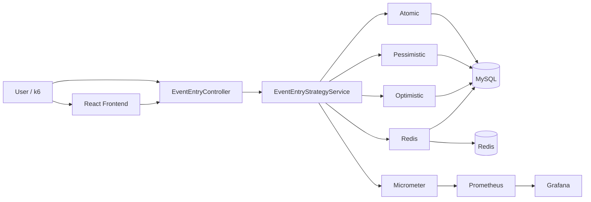
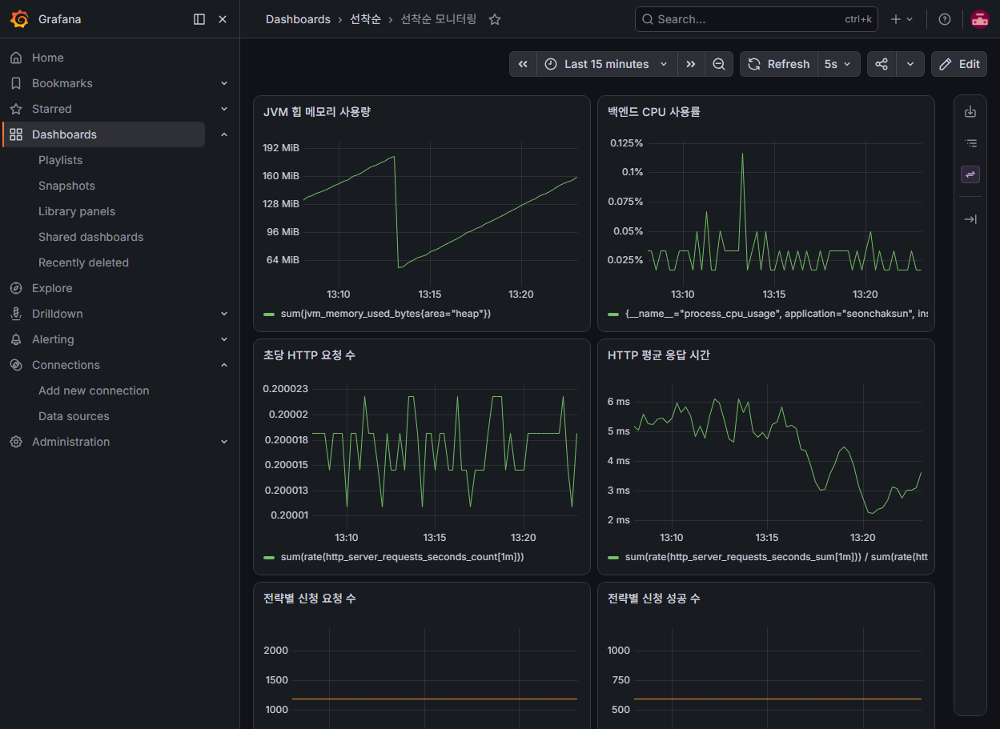

# 선착순

> **200개의 신청 요청이 몰려도, 정확하게 정원까지만 받을 수 있을까?**

선착순 이벤트처럼 많은 사용자가 짧은 시간에 동시에 신청할 때 발생하는
**동시성 문제를 직접 재현하고 해결 방법을 비교한 프로젝트**입니다.

다음 네 가지 방식을 구현했습니다.

* Atomic Update
* Pessimistic Lock
* Optimistic Lock
* Redis Lua Script

각 방식이 실제로 정원을 정확하게 지키는지 확인하고,
k6 부하 테스트와 Prometheus / Grafana를 이용해 성능 차이도 비교했습니다.

---

# 프로젝트를 쉽게 이해하면

예를 들어 **3명만 받을 수 있는 이벤트**가 있다고 가정합니다.

```text
정원: 3명

사용자 1001 신청 → 성공
사용자 1002 신청 → 성공
사용자 1003 신청 → 성공
사용자 1004 신청 → 실패
```

일반적인 상황에서는 간단해 보이지만 여러 사용자가 거의 동시에 신청하면 문제가 생길 수 있습니다.

```text
현재 신청자 = 2명

A 사용자 → 아직 자리 있네?
B 사용자 → 아직 자리 있네?

A 신청 성공
B 신청 성공

결과 → 정원은 3명인데 4명이 신청될 수 있음
```

이 프로젝트는 이런 문제를 막기 위한 여러 방법을 직접 구현하고 비교합니다.

---

# 핵심 변경 사항

현재 버전에서는 **하나의 이벤트에 하나의 동시성 처리 전략만 사용할 수 있습니다.**

기존처럼:

```text
이벤트 1
├─ Atomic
├─ Pessimistic
├─ Optimistic
└─ Redis
```

를 중간에 자유롭게 바꾸는 방식이 아니라:

```text
이벤트 1 → Atomic 전용

이벤트 2 → Pessimistic 전용

이벤트 3 → Optimistic 전용

이벤트 4 → Redis 전용
```

으로 동작합니다.

이렇게 변경한 이유는 Redis와 DB 기반 전략이 신청 인원을 관리하는 위치가 다르기 때문입니다.

전략을 한 이벤트에서 섞어서 사용할 경우 실제 정원을 초과할 가능성이 있기 때문에,
**이벤트를 생성할 때 전략을 하나 선택하고 이후에는 변경하지 못하도록 수정했습니다.**

---

# 처음 사용하는 사람을 위한 5분 테스트

## 준비 프로그램

화면으로 프로젝트를 체험하는 데 필요한 프로그램은 두 가지입니다.

* Docker Desktop
* Node.js / npm

GitHub에서 프로젝트를 직접 내려받고 싶다면 Git도 사용할 수 있습니다.

성능 테스트까지 진행하려면 추가로:

* k6

가 필요합니다.

Java 테스트까지 직접 실행하려면:

* Java 17

이 필요합니다.

---

# 1. 프로젝트 실행

먼저 Docker Desktop을 실행합니다.

그다음 PowerShell에서 프로젝트 폴더로 이동합니다.

예:

```powershell
cd C:\Users\사용자명\Desktop\seonchaksun
```

Docker 환경을 실행합니다.

```powershell
docker compose up -d --build
```

처음 실행하는 경우 Backend 이미지 생성 때문에 시간이 조금 더 걸릴 수 있습니다.

실행 상태를 확인합니다.

```powershell
docker compose ps
```

정상적인 경우 다음 서비스가 실행되어 있어야 합니다.

```text
seonchaksun-mysql
seonchaksun-redis
seonchaksun-backend
seonchaksun-prometheus
seonchaksun-grafana
```

`STATUS`가 `Up` 또는 `healthy`이면 정상입니다.

---

# 2. Frontend 실행

새 PowerShell 창을 하나 더 엽니다.

프로젝트의 `frontend` 폴더로 이동합니다.

```powershell
cd frontend
```

처음 한 번만 필요한 패키지를 설치합니다.

```powershell
npm.cmd install
```

Frontend를 실행합니다.

```powershell
npm.cmd run dev
```

정상적으로 실행되면 다음과 비슷한 주소가 표시됩니다.

```text
http://localhost:5173
```

Chrome 또는 Edge에서 접속합니다.

```text
http://localhost:5173
```

---

# 3. 가장 쉬운 선착순 테스트

처음에는 정원을 `100`으로 하지 말고 **3명**으로 테스트하는 것을 추천합니다.

화면의 **테스트 이벤트 생성** 영역에서 다음처럼 입력합니다.

```text
이벤트명
동시성 테스트

정원
3

처리 전략
Atomic - 조건부 업데이트
```

그리고:

```text
이벤트 생성
```

버튼을 누릅니다.

이벤트 생성 시간이 자동으로 설정되기 때문에 별도로 시작/종료 시간을 입력할 필요는 없습니다.

현재 구현에서는:

```text
시작 시간 = 생성 시점 약 1분 전
종료 시간 = 생성 시점 약 2시간 후
```

로 자동 설정됩니다.

---

# 4. 신청 테스트

이벤트를 생성하면 해당 이벤트가 자동으로 선택됩니다.

처리 전략도 생성할 때 선택한 방식으로 고정됩니다.

사용자 번호에:

```text
1001
```

을 입력하고:

```text
선착순 신청하기
```

를 누릅니다.

정상이면 신청 성공 메시지가 표시됩니다.

다음 사용자도 신청합니다.

```text
1002 → 성공
1003 → 성공
```

정원이 3명이므로:

```text
1004 → 실패
```

가 되어야 합니다.

즉 결과는:

```text
정원     = 3명

1001    성공
1002    성공
1003    성공
1004    정원 초과로 실패
```

가 정상입니다.

---

# 5. 중복 신청 테스트

이미 성공한 사용자 번호를 다시 입력합니다.

예:

```text
1001
```

다시:

```text
선착순 신청하기
```

를 누릅니다.

정상이라면 중복 신청이 거절됩니다.

```text
1001 첫 번째 신청 → 성공

1001 두 번째 신청 → 실패
```

DB에도:

```text
UNIQUE(event_id, user_id)
```

제약조건을 두어 동일 사용자가 같은 이벤트에 중복 신청하지 못하도록 했습니다.

---

# 6. 다른 전략 테스트

다른 방식을 테스트하고 싶다면 **기존 이벤트의 전략을 변경하는 것이 아니라 새로운 이벤트를 생성해야 합니다.**

예를 들어 Redis를 확인하려면:

```text
이벤트명
Redis 테스트

정원
3

처리 전략
Redis - Redis 선점
```

으로 새로운 이벤트를 생성합니다.

그리고 다시:

```text
1001 → 성공
1002 → 성공
1003 → 성공
1004 → 실패
```

가 되는지 확인합니다.

각 전략은 별도의 이벤트를 사용해야 합니다.

```text
Atomic 테스트       → Event A
Pessimistic 테스트  → Event B
Optimistic 테스트   → Event C
Redis 테스트        → Event D
```

---

# 네 가지 전략을 쉽게 이해하면

| 화면 표시                  | 실제 방식            | 쉽게 설명하면                 |
| ---------------------- | ---------------- | ----------------------- |
| Atomic - 조건부 업데이트      | Atomic Update    | 정원 확인과 증가를 DB가 한 번에 처리  |
| Pessimistic - DB 잠금    | Pessimistic Lock | 한 요청이 처리 중이면 다른 요청은 기다림 |
| Optimistic - 버전 충돌 재시도 | Optimistic Lock  | 먼저 처리하고 충돌하면 다시 시도      |
| Redis - Redis 선점       | Redis Lua Script | 빠른 Redis가 먼저 번호표를 발급    |

---

## Atomic Update

DB에게:

```text
현재 인원이 정원보다 적으면
신청 인원을 1 증가시켜라.
```

라는 작업을 한 번에 요청합니다.

예:

```text
현재 2명 / 정원 3명

A 신청
→ 2 < 3
→ 3명

B 신청
→ 3 < 3 아님
→ 실패
```

구현이 비교적 단순하면서 정합성을 유지할 수 있습니다.

---

## Pessimistic Lock

한 사용자가 이벤트를 처리하는 동안 해당 데이터를 잠급니다.

```text
A 신청

↓
Event 잠금

B 신청
↓
대기

A 처리 완료
↓
잠금 해제

B 처리
```

정합성을 이해하기 쉽고 안정적이지만 요청이 많아지면 Lock 대기가 발생할 수 있습니다.

---

## Optimistic Lock

처음부터 데이터를 잠그지는 않습니다.

대신 데이터의 `version` 값을 확인합니다.

```text
A → version 10 조회
B → version 10 조회

A → 수정 성공
     version 11

B → 수정 시도

"내가 읽었을 때는 10이었는데
지금은 11이네?"

→ 충돌
→ 잠깐 기다림
→ 다시 시도
```

충돌이 적은 환경에서는 효율적이지만 선착순처럼 요청이 몰리는 환경에서는 Retry가 많이 발생할 수 있습니다.

---

## Redis Lua Script

Redis를 빠른 번호표 발급기처럼 사용합니다.

```text
신청 요청
↓
Redis

현재 신청자 확인
↓
정원 확인
↓
카운터 증가
↓
MySQL에 신청 정보 저장
```

Redis Lua Script 안에서:

```text
현재 값 조회
+
정원 확인
+
카운터 증가
```

를 한 번에 수행합니다.

---

# 프로젝트 전체 흐름

```text
사용자
  ↓
React Frontend
  ↓
Spring Boot API
  ↓
이벤트에 설정된 전략 확인
  ↓
┌──────────────────────────────┐
│ Atomic                       │
│ Pessimistic                  │
│ Optimistic                   │
│ Redis                        │
└──────────────────────────────┘
  ↓
MySQL / Redis
  ↓
신청 성공 또는 실패
  ↓
화면에 결과 표시
```

---

# Architecture




---

# Event 구조

이벤트에는 다음 정보가 저장됩니다.

```text
Event
├─ id
├─ name
├─ capacity
├─ currentCount
├─ strategy
├─ openAt
├─ closeAt
└─ version
```

중요한 변경점은 `strategy`입니다.

```text
strategy = ATOMIC
strategy = PESSIMISTIC
strategy = OPTIMISTIC
strategy = REDIS
```

중 하나가 이벤트 생성 시 저장됩니다.

생성 이후 다른 전략으로 요청하면 서버가 거절합니다.

---

# 전략 혼용 방지

예를 들어 다음 이벤트가 있다고 가정합니다.

```text
Event 10

capacity = 100
strategy = REDIS
```

해당 이벤트에 Atomic 방식으로 요청하면:

```text
REDIS Event
↓
Atomic 요청
↓
STRATEGY_MISMATCH
↓
400 Bad Request
```

가 반환됩니다.

이를 통해 같은 이벤트에서 Redis와 DB 기반 카운터가 섞여 정원을 초과하는 문제를 방지합니다.

---

# API 오류 처리

주요 오류는 다음과 같이 처리합니다.

| HTTP | Code              | 의미                    |
| ---- | ----------------- | --------------------- |
| 400  | INVALID_STRATEGY  | 존재하지 않는 전략 요청         |
| 400  | STRATEGY_MISMATCH | 이벤트에 설정된 전략과 다른 전략 요청 |
| 404  | EVENT_NOT_FOUND   | 존재하지 않는 이벤트           |
| 409  | DUPLICATE_ENTRY   | 동일 사용자의 중복 신청         |

---

# DB Migration

DB 구조 변경은 Flyway로 관리합니다.

```text
V1__create_events_table.sql
V2__create_event_entries_table.sql
V3__add_event_version.sql
V4__add_event_strategy.sql
```

`V4`에서 Event에 `strategy` 컬럼을 추가했습니다.

기존 이벤트는 어떤 전략으로 생성되었는지 알 수 없기 때문에 migration 시 기본적으로:

```text
ATOMIC
```

으로 설정됩니다.

따라서 Redis / Pessimistic / Optimistic 테스트는 새 이벤트를 생성해서 사용하는 것을 권장합니다.

---

# 주요 접속 주소

| 서비스                | 주소                                          |
| ------------------ | ------------------------------------------- |
| Frontend           | `http://localhost:5173`                     |
| Backend            | `http://localhost:8080`                     |
| Swagger            | `http://localhost:8080/swagger`             |
| Health Check       | `http://localhost:8080/actuator/health`     |
| Prometheus Metrics | `http://localhost:8080/actuator/prometheus` |
| Prometheus         | `http://localhost:9090`                     |
| Grafana            | `http://localhost:3000`                     |

Grafana 기본 로그인:

```text
ID: admin
PW: admin
```

---

# Docker 포트

현재 Docker Compose 기준 포트는 다음과 같습니다.

| 서비스        | PC에서 사용하는 포트 | Docker 내부 |
| ---------- | -----------: | --------: |
| MySQL      |         3307 |      3306 |
| Redis      |         6380 |      6379 |
| Backend    |         8080 |      8080 |
| Prometheus |         9090 |      9090 |
| Grafana    |         3000 |      3000 |

Redis 외부 포트를 `6380`으로 사용하는 이유는 다른 프로젝트나 로컬 Redis가 흔히 사용하는 `6379`와 충돌하는 것을 줄이기 위해서입니다.

Docker 안에서 Backend는 Redis를:

```text
redis:6379
```

로 사용하므로 외부 포트와 관계없이 정상 통신합니다.

---

# Backend 테스트 실행

Backend 테스트를 직접 실행하려면 Java 17이 필요합니다.

먼저 MySQL과 Redis를 실행합니다.

```powershell
docker compose up -d mysql redis
```

현재 Redis는 PC에서 `6380` 포트를 사용하므로 PowerShell에서 테스트할 때 Redis 포트를 지정합니다.

```powershell
$env:REDIS_PORT="6380"

.\gradlew.bat clean test
```

테스트가 모두 성공하면 마지막에:

```text
BUILD SUCCESSFUL
```

이 표시됩니다.

테스트 후 환경 변수를 제거하고 싶다면:

```powershell
Remove-Item Env:REDIS_PORT
```

를 실행합니다.

---

# 테스트 실패 시 확인

## MySQL 연결 실패

다음 오류가 발생한다면:

```text
FlywaySqlUnableToConnectToDbException
CommunicationsException
ConnectException
```

MySQL이 실행 중인지 확인합니다.

```powershell
docker compose ps
```

`seonchaksun-mysql`이 `healthy`인지 확인합니다.

---

## Redis 포트 충돌

다음 오류가 발생한다면:

```text
Bind for 0.0.0.0:6379 failed:
port is already allocated
```

이미 다른 Redis가 `6379`를 사용 중이라는 의미입니다.

현재 seonchaksun 프로젝트는 외부 Redis 포트를:

```text
6380
```

으로 사용하도록 설정되어 있습니다.

확인은:

```powershell
docker compose ps
```

로 할 수 있습니다.

---

## Docker Backend 다시 빌드

소스 코드를 수정한 후 Docker에서 변경 사항이 보이지 않는다면 Backend 이미지를 다시 생성합니다.

```powershell
docker compose down
docker compose up -d --build
```

캐시까지 완전히 무시하고 다시 빌드하려면:

```powershell
docker compose down
docker compose build --no-cache backend
docker compose up -d
```

를 사용합니다.

---

# 성능 테스트

단순 화면 테스트보다 실제로 여러 요청을 보내고 싶다면 k6를 사용할 수 있습니다.

k6가 설치되어 있어야 합니다.

현재 테스트 조건:

```text
총 요청 수 = 200
동시 VU = 32
정원 = 100
```

즉 정확히 200명이 같은 순간에 요청하는 테스트라기보다:

```text
32개의 가상 사용자가
총 200개의 신청 요청을 처리
```

하는 테스트입니다.

---

## Atomic

```powershell
.\scripts\benchmark.ps1 -Strategy atomic
```

## Pessimistic

```powershell
.\scripts\benchmark.ps1 -Strategy pessimistic
```

## Optimistic

```powershell
.\scripts\benchmark.ps1 -Strategy optimistic
```

## Redis

```powershell
.\scripts\benchmark.ps1 -Strategy redis
```

Benchmark Script는 전략별로 새로운 Event를 자동 생성합니다.

```text
Event 생성
↓
Warm-up 1회
↓
10초 대기
↓
Measured Run 1
↓
10초 대기
↓
Measured Run 2
↓
...
↓
Measured Run 5
```

따라서 서로 다른 전략의 카운터가 섞이지 않습니다.

---

# 기대 결과

정원 100명 이벤트에 총 200개의 요청을 보내는 경우 목표는:

```text
Success             = 100
Business Failure    = 100
Unexpected Failure  = 0
```

입니다.

여기서 `Business Failure`는 시스템 장애가 아닙니다.

예를 들어:

```text
정원이 이미 마감됨
중복 신청
```

처럼 정상적으로 거절된 요청입니다.

가장 중요한 값은:

```text
Unexpected Failure = 0
```

입니다.

---

# 모니터링

Backend는 Micrometer를 이용해 지표를 수집합니다.

```text
Spring Boot
↓
Micrometer
↓
/actuator/prometheus
↓
Prometheus
↓
Grafana
```

Grafana:

```text
http://localhost:3000
```

기본 로그인:

```text
admin / admin
```



---

# Tech Stack

## Backend

* Java 17
* Spring Boot
* Spring Web MVC
* Spring Data JPA
* Bean Validation
* Flyway
* Gradle

## Database / Cache

* MySQL 8.4
* Redis

## Frontend

* React
* Vite

## Test

* JUnit 5
* Mockito
* k6

## Monitoring

* Spring Boot Actuator
* Micrometer
* Prometheus
* Grafana

## Infrastructure

* Docker
* Docker Compose

---

# 프로젝트에서 확인한 문제

처음 구현에서는 단순하게:

```text
Event 조회
↓
현재 신청자 확인
↓
currentCount + 1
↓
저장
```

방식으로 처리했습니다.

하지만 여러 요청이 동시에 접근하면:

```text
Thread A → currentCount = 20 조회
Thread B → currentCount = 20 조회
Thread C → currentCount = 20 조회

A → 21 저장
B → 21 저장
C → 21 저장
```

처럼 여러 요청의 변경 내용이 덮어써지는 **Lost Update**가 발생했습니다.

이 문제를 기준으로 네 가지 전략을 구현했습니다.

---

# 프로젝트 진행 과정

```text
단순 구현
    ↓
동시성 문제 재현
    ↓
Lost Update 확인
    ↓
Atomic Update 구현
    ↓
Pessimistic Lock 구현
    ↓
Optimistic Lock + Retry 구현
    ↓
Redis Lua Script 구현
    ↓
동시성 테스트
    ↓
k6 HTTP 부하 테스트
    ↓
MySQL MVCC 문제 발견
    ↓
Locking Read 적용
    ↓
Prometheus / Grafana 모니터링
    ↓
전략별 Trade-off 비교
```

---

# 전략 비교

| 전략          | 핵심 방식           | 장점          | 고려사항                    |
| ----------- | --------------- | ----------- | ----------------------- |
| Atomic      | 조건부 UPDATE      | 단순하고 안정적    | Event Row 경합            |
| Pessimistic | DB Row Lock     | 정합성 이해가 쉬움  | Lock Wait               |
| Optimistic  | Version + Retry | Lock 대기를 줄임 | 높은 경합에서 Retry 증가        |
| Redis       | Lua Counter     | 높은 처리량      | Redis + MySQL 정합성 관리 필요 |

어떤 전략이 항상 가장 좋다고 볼 수는 없습니다.

트래픽 규모, 인프라 구성, 데이터 정합성 요구사항에 따라 선택해야 합니다.

---

# Redis + MySQL의 한계

Redis 전략은:

```text
Redis 자리 확보
↓
MySQL 신청 내역 저장
```

순서로 처리합니다.

MySQL 저장에 실패하면 Redis 카운터를 다시 감소시키는 보상 처리를 수행합니다.

하지만 다음 상황까지 완벽하게 하나의 Transaction으로 묶을 수는 없습니다.

```text
Redis 성공
↓
MySQL 처리 성공
↓
Transaction Commit 실패
```

또는:

```text
MySQL 실패
↓
Redis 보상 처리도 실패
```

실제 서비스라면 다음과 같은 방법을 추가로 고려할 수 있습니다.

* Retry Queue
* Reconciliation
* Transactional Outbox
* 메시지 큐 기반 비동기 처리

이 프로젝트에서는 이러한 구조적 한계를 숨기지 않고 명시적으로 문서화했습니다.

---

# 종료 방법

프로젝트 사용을 끝냈다면 Docker 서비스를 종료할 수 있습니다.

```powershell
docker compose down
```

데이터까지 모두 삭제하고 완전히 초기화하려면:

```powershell
docker compose down -v
```

`-v`를 사용하면 MySQL / Redis 데이터도 삭제되므로 주의해야 합니다.

---

# 가장 간단한 체험 순서 요약

개발을 잘 모른다면 아래 순서만 따라 하면 됩니다.

```text
1. Docker Desktop 실행

2. 프로젝트 폴더에서
   docker compose up -d --build

3. 새 PowerShell에서
   cd frontend
   npm.cmd install
   npm.cmd run dev

4. Chrome에서
   http://localhost:5173

5. 이벤트 생성
   이름: 테스트
   정원: 3
   전략: Atomic

6. 사용자 신청
   1001 → 성공
   1002 → 성공
   1003 → 성공
   1004 → 실패

7. 1001 다시 신청
   → 중복 신청 실패

8. 새로운 이벤트 생성
   전략: Redis

9. 동일하게 신청 테스트

10. Atomic / Redis 결과 비교
```

이 흐름만 확인해도 프로젝트의 핵심 기능을 직접 체험할 수 있습니다.

---

# 상세 기술 문서

동시성 전략별 자세한 구현 및 분석은 다음 문서를 참고합니다.

```text
docs/concurrency-strategy.md
```

프로젝트 수정 내역은:

```text
PATCH_NOTES.md
```

에서 확인할 수 있습니다.
