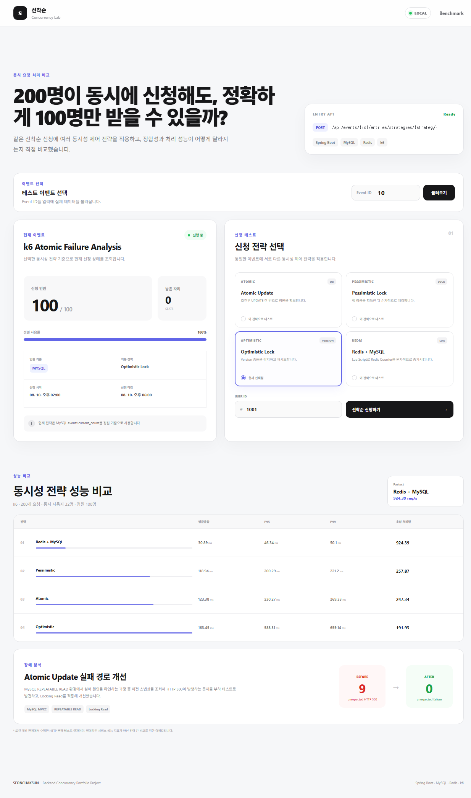

# 선착순

> **200명이 동시에 신청해도, 정확하게 100명만 받을 수 있을까?**

동시에 다수의 요청이 몰리는 선착순 신청 환경에서  
**정확한 정원 제어와 동시성 처리 전략을 비교·검증한 프로젝트**입니다.

단순 CRUD 기능을 늘리는 대신 하나의 핵심 문제인 **동시성 제어**를 깊게 다룹니다.

```text
가장 단순한 구현
→ 문제 재현
→ 원인 분석
→ 동시성 전략 적용
→ 정합성 검증
→ 성능 측정
→ 장애 발견
→ 원인 분석
→ 개선
→ 재측정
```

<p align="center">
  
</p>

---

## 프로젝트 목표

정원이 100명인 이벤트에 200개의 요청이 몰리더라도:

```text
총 요청 = 200
정원 = 100

신청 성공 = 100
정원 초과 실패 = 100
실제 저장된 신청 = 100
```

을 정확하게 보장하는 것이 핵심 목표입니다.

또한 단순히 하나의 동시성 제어 기술을 적용하는 데서 끝내지 않고 다음 전략을 동일한 요구사항에 적용해 비교했습니다.

- Atomic Update
- Pessimistic Lock
- Optimistic Lock
- Redis Lua Script + MySQL

---

# 문제 재현

## Naive Read-Modify-Write

최초 구현은 일반적인 JPA 방식이었습니다.

```text
Event 조회
→ currentCount 확인
→ currentCount + 1
→ EventEntry 저장
```

동시성 테스트 조건:

```text
요청 Task = 200
이벤트 정원 = 100
Worker Thread = 32
```

결과:

```text
서비스 성공 = 40
서비스 실패 = 160

Event.currentCount = 20
EventEntry count = 40
```

실제로는 40건의 신청이 저장되었지만 이벤트 카운트는 20만 증가했습니다.

여러 Transaction이 같은 `currentCount` 값을 조회한 뒤 각각 수정하면서 다른 Transaction의 변경 결과를 덮어쓰는 **Lost Update**가 발생했습니다.

테스트 과정에서는 MySQL Deadlock도 관찰했습니다.

다만 InnoDB Deadlock Graph까지 수집하지 않았기 때문에 정확한 Lock 순서와 발생 원인은 단정하지 않습니다.

---

# 핵심 불변식

DB 기반 전략에서는 다음 관계가 유지되어야 합니다.

```text
Success
==
Event.currentCount
==
EventEntry count
<=
capacity
```

Redis 전략에서는 `events.current_count`를 사용하지 않습니다.

```text
Success
==
Redis count
==
EventEntry count
<=
capacity
```

---

# 적용한 동시성 전략

## 1. Atomic Update

정원 확인과 신청 인원 증가를 하나의 UPDATE Statement에서 수행합니다.

```java
@Modifying(
    flushAutomatically = true,
    clearAutomatically = true
)
@Query("""
    UPDATE Event e
    SET e.currentCount = e.currentCount + 1,
        e.version = e.version + 1
    WHERE e.id = :eventId
      AND e.currentCount < e.capacity
      AND e.openAt <= :now
      AND e.closeAt > :now
""")
int incrementCurrentCount(
        Long eventId,
        LocalDateTime now
);
```

기존:

```text
SELECT
→ 조건 확인
→ UPDATE
```

개선:

```text
조건 확인 + UPDATE
→ 하나의 Statement
```

DB가 정원 조건을 직접 확인하면서 값을 원자적으로 증가시킵니다.

### 특징

**장점**

- 구조가 비교적 단순
- 추가 인프라 불필요
- Application Retry 불필요
- Lost Update 방지

**단점**

- 모든 요청이 동일 Event row를 갱신
- 높은 트래픽에서는 Hot Row Contention 발생 가능

---

## 2. Pessimistic Lock

이벤트 조회 시 `PESSIMISTIC_WRITE` Lock을 획득합니다.

```text
SELECT Event FOR UPDATE

→ Lock 획득
→ 정원 확인
→ 신청 처리
→ COMMIT
→ Lock 해제
```

### 특징

**장점**

- 동작 방식이 직관적
- 충돌을 사전에 차단
- Retry 로직 불필요

**단점**

- Lock 대기 발생
- Transaction이 길어질수록 대기 증가
- DB Connection 점유 시간 증가 가능

이번 프로젝트에서는 Critical Section을 최대한 짧게 유지했습니다.

---

## 3. Optimistic Lock

Event Entity의 `@Version`을 이용해 충돌을 감지합니다.

```text
Event 조회
→ 비즈니스 로직
→ UPDATE WHERE version = ?
→ Version 충돌
→ Rollback
→ Backoff
→ 새로운 Transaction으로 Retry
```

Retry와 Transaction을 분리하기 위해:

```text
Facade
   ↓
Worker
   ↓
새 Transaction
```

구조를 사용했습니다.

Retry 대상:

```text
ObjectOptimisticLockingFailureException
CannotAcquireLockException
```

최대 Retry:

```text
100회
```

Random Backoff:

```text
1 ~ 5 ms
```

### 특징

충돌이 적은 환경에서는 효율적일 수 있지만, 이번 프로젝트처럼 하나의 인기 Event row에 요청이 집중되는 환경에서는:

```text
Version Conflict
→ Rollback
→ Retry
→ Backoff
```

비용이 크게 발생했습니다.

---

## 4. Redis Lua Script + MySQL

Redis를 Distributed Lock 용도로 사용하지 않고 **원자적인 정원 Counter**로 사용했습니다.

정원 확보 Lua Script:

```lua
local current = tonumber(redis.call('GET', KEYS[1]) or '0')
local capacity = tonumber(ARGV[1])

if current >= capacity then
    return 0
end

redis.call('INCR', KEYS[1])

return 1
```

처리 과정:

```text
Redis Counter 조회
→ capacity 비교
→ INCR
```

이 세 작업을 Lua Script 하나로 실행하기 때문에 요청 사이에 다른 연산이 끼어들지 않습니다.

Redis와 MySQL의 역할은 다음과 같이 분리했습니다.

```text
Redis
→ 정원 Admission Control

MySQL
→ 실제 EventEntry 저장
```

### Redis를 Distributed Lock으로 사용하지 않은 이유

현재 요구사항은:

```text
현재 인원 확인
→ 정원이 남았는지 확인
→ 한 자리 확보
```

입니다.

이를 위해:

```text
Lock 획득
→ 처리
→ Lock 해제
```

구조까지 사용할 필요는 없다고 판단했습니다.

Redis Lua Script 하나로 정원 확인과 증가를 원자적으로 처리했습니다.

---

# 중복 신청 Race Condition

정원 문제와 별개로 동일 사용자의 중복 신청도 동시성 문제가 발생합니다.

```text
existsByEventIdAndUserId()
→ false
→ INSERT
```

두 Transaction이 동시에 조회하면:

```text
Transaction A → false
Transaction B → false
```

가 가능합니다.

따라서 애플리케이션 사전 조회만으로는 중복 신청을 완전히 방지할 수 없습니다.

최종 불변식은 DB가 보장하도록 했습니다.

```text
UNIQUE(event_id, user_id)
```

즉:

```text
Application Validation
+
Database UNIQUE Constraint
```

구조입니다.

---

## 동일 사용자 동시 요청 테스트

동일 사용자가 동시에 20번 신청하도록 테스트했습니다.

```text
요청 = 20

성공 = 1
중복 실패 = 19
예상하지 못한 실패 = 0
```

Redis 전략에서도:

```text
Redis count = 1
EventEntry count = 1
```

을 유지했습니다.

---

# Redis + MySQL Dual Write

Redis와 MySQL은 하나의 Local Transaction으로 묶이지 않습니다.

예를 들어:

```text
Redis reserve 성공

0 → 1

↓

MySQL INSERT 실패
```

가 발생하면:

```text
Redis count = 1
EventEntry count = 0
```

이라는 불일치가 생길 수 있습니다.

이를 줄이기 위해 DB 저장 실패 시 Redis 예약을 반환하는 보상 처리를 구현했습니다.

```text
Redis reserve

↓

EventEntry saveAndFlush

├─ 성공
│   └─ 종료
│
└─ 실패
    ↓
Redis release
    ↓
예외 반환
```

DB 저장 실패를 Mock으로 발생시킨 테스트에서도 최종:

```text
Redis count = 0
```

으로 복원되는 것을 확인했습니다.

---

## 현재 보상 처리의 한계

현재 Compensation이 완전한 Distributed Transaction을 의미하지는 않습니다.

예를 들어:

```text
Redis reserve 성공
→ saveAndFlush 성공
→ Service 반환
→ 실제 DB COMMIT 실패
```

와 같은 상황에서는 Service 내부의 `catch`가 실제 Commit 실패를 감지하지 못할 수 있습니다.

또한:

```text
DB 저장 실패
→ Redis release
→ Redis 장애
```

처럼 보상 자체가 실패할 수도 있습니다.

향후 필요하다면 다음 방법을 검토할 수 있습니다.

```text
TransactionSynchronization
Retry Queue
Reconciliation
Outbox Pattern
```

현재 프로젝트 범위에서는 XA / 2PC는 복잡도가 과도하다고 판단해 적용하지 않았습니다.

---

# Integration Test 성능 비교

먼저 HTTP 계층을 제외한 Integration Test 기준으로 전략별 처리 시간을 비교했습니다.

테스트 조건:

```text
요청 Task = 200
정원 = 100
Worker Thread = 32
전략별 반복 = 5회
```

| Strategy | Average | Min | Max |
|---|---:|---:|---:|
| Redis + MySQL | **183.40 ms** | 153 ms | 231 ms |
| Pessimistic Lock | 670.60 ms | 634 ms | 759 ms |
| Atomic Update | 683.60 ms | 568 ms | 920 ms |
| Optimistic Lock | 1096.40 ms | 992 ms | 1196 ms |

이 측정은:

```text
Spring Service
Transaction
JPA
MySQL
Redis
```

경로를 중심으로 한 비교입니다.

HTTP Controller, JSON Serialization, 실제 HTTP Connection은 포함하지 않습니다.

---

# k6 HTTP 부하 테스트

실제 HTTP 요청 전체 경로를 비교하기 위해 k6 테스트를 추가했습니다.

대상 API:

```text
POST /api/events/{eventId}/entries/strategies/{strategy}
```

테스트 조건:

```text
총 요청 = 200
Virtual Users = 32
이벤트 정원 = 100
Executor = shared-iterations
Max Duration = 30s
```

`32 VUs / 200 shared iterations` 구조이므로 200개의 요청이 물리적으로 정확히 같은 순간에 시작되는 테스트는 아닙니다.

각 요청에는 서로 다른 User ID를 사용했습니다.

```javascript
exec.scenario.iterationInTest + 1
```

응답은 다음과 같이 분류했습니다.

```text
201
→ success

400 / 409
→ business_failure

예상하지 못한 상태
→ unexpected_failure
```

---

## 최종 HTTP 성능 결과

| Strategy | Avg | p95 | p99 | Req/s | Unexpected |
|---|---:|---:|---:|---:|---:|
| **Redis + MySQL** | **30.89 ms** | **46.34 ms** | **50.10 ms** | **924.39** | 0 |
| Pessimistic Lock | 118.94 ms | 200.29 ms | 221.20 ms | 257.87 | 0 |
| Atomic Update | 123.38 ms | 230.27 ms | 269.33 ms | 247.34 | 0 |
| Optimistic Lock | 163.45 ms | 588.31 ms | 659.14 ms | 191.93 | 0 |

모든 최종 테스트에서:

```text
Success = 100
Business Failure = 100
Unexpected Failure = 0
```

을 만족했습니다.

---

## 결과 해석

### Redis + MySQL

이번 로컬 테스트에서는 가장 낮은 응답시간과 가장 높은 처리량을 기록했습니다.

정원 경쟁을 MySQL의 동일 Event row에서 Redis Lua Script로 이동시켜 DB Hot Row Write Contention을 줄인 것이 결과에 영향을 준 것으로 판단합니다.

다만 Redis 도입 시:

```text
추가 인프라
Dual Write
Compensation
장애 복구
Reconciliation
```

복잡도가 함께 증가합니다.

따라서:

```text
Redis가 가장 빨랐다
=
Redis가 항상 최선이다
```

라고 결론 내리지는 않습니다.

### Pessimistic Lock

이번 조건에서는 Atomic Update와 큰 차이가 나지 않았습니다.

Lock 자체보다:

```text
Transaction 길이
Critical Section 크기
경합 정도
```

가 중요하다는 것을 확인했습니다.

### Optimistic Lock

평균 응답시간뿐 아니라 Tail Latency가 크게 증가했습니다.

```text
p95 = 588.31 ms
p99 = 659.14 ms
```

높은 Hot Row Contention 환경에서 Retry / Rollback / Backoff 비용이 누적된 것으로 판단합니다.

---

# 부하 테스트에서 발견한 Atomic Update 장애

단순한 성능 비교 과정에서 Atomic Update 전략에 HTTP 500 문제가 존재한다는 것을 발견했습니다.

초기 결과:

```text
Success = 100
Business Failure = 91
Unexpected Failure = 9
```

정원이 100명이므로 예상 결과는:

```text
Success = 100
Business Failure = 100
Unexpected Failure = 0
```

이었습니다.

---

## 서버 로그 분석

발생 예외:

```text
IllegalStateException:
이벤트 신청 실패 원인을 확인할 수 없습니다.
```

Atomic UPDATE가 실패한 뒤 실패 원인을 판별하는 코드에서 발생했습니다.

기존 흐름:

```text
Atomic UPDATE

↓

updated == 0

↓

findById(eventId)

↓

실패 원인 판별
```

MySQL Transaction Isolation Level은:

```text
REPEATABLE_READ
```

였습니다.

---

## 원인

실제 DB 상태가:

```text
currentCount = 100
capacity = 100
```

이라면 Atomic UPDATE는:

```text
WHERE currentCount < capacity
```

조건을 만족하지 못해:

```text
updated = 0
```

을 반환합니다.

하지만 같은 Transaction에서 이후 수행한 일반 SELECT가 기존 MVCC Snapshot의:

```text
currentCount = 95
capacity = 100
```

상태를 조회할 수 있었습니다.

애플리케이션 입장에서는:

```text
이벤트 존재
신청 기간 정상
정원도 남아 있음
```

이므로 Atomic UPDATE가 실패한 원인을 찾지 못하게 됩니다.

결국:

```text
IllegalStateException
→ HTTP 500
```

으로 이어졌습니다.

---

## 개선

실패 원인을 판별하는 조회를:

```text
findById()
```

에서:

```text
findByIdWithPessimisticLock()
```

으로 변경했습니다.

Locking Read를 사용해 실패 판별 시 최신 Row 상태를 조회하도록 했습니다.

중요한 점은 **Atomic 전략 전체를 Pessimistic Lock 방식으로 변경한 것이 아닙니다.**

정상 신청:

```text
Atomic Conditional UPDATE
```

실패 원인 확인:

```text
Locking Read
```

구조입니다.

---

## 개선 결과

수정 후 동일한 k6 테스트를 다시 수행했습니다.

```text
Before

Success = 100
Business Failure = 91
Unexpected Failure = 9
```

```text
After

Success = 100
Business Failure = 100
Unexpected Failure = 0
```

최종 Atomic 성능:

```text
Avg = 123.38 ms
p95 = 230.27 ms
p99 = 269.33 ms
Req/s = 247.34
```

이 과정을 통해:

```text
부하 테스트
→ HTTP 500 발견
→ Stack Trace 분석
→ Transaction Isolation 확인
→ MVCC Snapshot 분석
→ Consistent Read / Locking Read 비교
→ 코드 개선
→ 부하 테스트 재실행
```

과정을 경험했습니다.

특히:

```text
JPA Persistence Context clear
!=
MySQL MVCC Snapshot 초기화
```

라는 점을 확인했습니다.

자세한 분석은  
[동시성 전략 설계 문서](docs/concurrency-strategy.md)에 정리했습니다.

---

# 기술 스택

## Backend

- Java 17
- Spring Boot 4.1.0
- Spring Web MVC
- Spring Data JPA
- Spring Data Redis
- Bean Validation
- Flyway

## Database / Cache

- MySQL 8.4
- Redis 8

## Concurrency

- Atomic Update
- Pessimistic Lock
- Optimistic Lock
- Redis Lua Script

## Test

- JUnit 5
- Mockito
- Testcontainers 2.0.5
- k6

## Frontend

- React
- Vite

## API Documentation

- OpenAPI
- Swagger UI

## Infrastructure

- Docker
- Docker Compose

## Build

- Gradle 9.5.1

---

# 프로젝트 구조

```text
seonchaksun
│
├─ src
│  ├─ main
│  │  ├─ java/com/seonchaksun
│  │  │  ├─ common
│  │  │  ├─ event
│  │  │  └─ entry
│  │  │
│  │  └─ resources
│  │     └─ db/migration
│  │
│  └─ test
│
├─ frontend
│  └─ React / Vite
│
├─ k6
│  └─ entry-burst.js
│
├─ docs
│  ├─ images
│  │  └─ dashboard.png
│  │
│  └─ concurrency-strategy.md
│
├─ docker-compose.yml
├─ build.gradle
└─ README.md
```

---

# API

## Event

### 이벤트 생성

```http
POST /api/events
```

Request:

```json
{
  "name": "한정판 키보드 사전예약",
  "capacity": 100,
  "openAt": "2026-08-11T14:00:00",
  "closeAt": "2026-08-11T18:00:00"
}
```

### 이벤트 조회

```http
GET /api/events/{eventId}
```

### 전략별 신청 현황

```http
GET /api/events/{eventId}/status?strategy={strategy}
```

DB 기반 전략:

```text
Atomic
Pessimistic
Optimistic

Count Source = MYSQL
```

Redis 전략:

```text
Count Source = REDIS
```

---

## Event Entry

### 기본 신청

현재 기본 전략은 Atomic Update입니다.

```http
POST /api/events/{eventId}/entries
```

Request:

```json
{
  "userId": 1001
}
```

### 전략 선택 신청

```http
POST /api/events/{eventId}/entries/strategies/{strategy}
```

지원 전략:

```text
atomic
pessimistic
optimistic
redis
```

---

# API 응답

신청 API는 Swagger에서 다음 응답을 확인할 수 있습니다.

```text
201
신청 성공

400
정원 초과
신청 기간 아님
지원하지 않는 전략

404
존재하지 않는 이벤트

409
동일 사용자의 중복 신청
```

---

# Swagger / OpenAPI

Spring Boot 실행 후 Swagger UI:

```text
http://localhost:8080/swagger
```

OpenAPI JSON:

```text
http://localhost:8080/v3/api-docs
```

Swagger의 `Try it out` 기능을 이용해 API를 직접 호출할 수 있습니다.

---

# 로컬 실행

## 1. MySQL / Redis 실행

프로젝트 루트에서:

```powershell
docker compose up -d
```

상태 확인:

```powershell
docker compose ps
```

실행되는 Container:

```text
seonchaksun-mysql
seonchaksun-redis
```

포트:

```text
MySQL
localhost:3307

Redis
localhost:6379
```

Redis 연결 확인:

```powershell
docker exec -it seonchaksun-redis redis-cli ping
```

정상 결과:

```text
PONG
```

---

## 2. Spring Boot 실행

IntelliJ에서:

```text
SeonchaksunApplication
```

을 실행합니다.

또는:

```powershell
.\gradlew.bat bootRun
```

Backend:

```text
http://localhost:8080
```

애플리케이션 실행 시 Flyway가 DB Migration을 자동으로 적용합니다.

---

## 3. Frontend 실행

새 PowerShell에서:

```powershell
cd frontend
npm.cmd install
npm.cmd run dev
```

Frontend:

```text
http://localhost:5173
```

---

## 4. Swagger

```text
http://localhost:8080/swagger
```

---

# 테스트

전체 테스트:

```powershell
.\gradlew.bat test
```

Clean Test:

```powershell
.\gradlew.bat clean test
```

주요 검증 항목:

```text
Event Domain Rule

Naive Concurrency

Atomic Update

Pessimistic Lock

Optimistic Lock

Redis Reservation

동일 사용자 중복 신청

DB UNIQUE Constraint

Redis Compensation

동시성 정합성
```

---

# k6 실행

스크립트:

```text
k6/entry-burst.js
```

Redis 전략:

```powershell
k6 run `
  -e EVENT_ID=15 `
  -e STRATEGY=redis `
  .\k6\entry-burst.js
```

Atomic:

```powershell
k6 run `
  -e EVENT_ID=15 `
  -e STRATEGY=atomic `
  .\k6\entry-burst.js
```

Pessimistic:

```powershell
k6 run `
  -e EVENT_ID=15 `
  -e STRATEGY=pessimistic `
  .\k6\entry-burst.js
```

Optimistic:

```powershell
k6 run `
  -e EVENT_ID=15 `
  -e STRATEGY=optimistic `
  .\k6\entry-burst.js
```

측정 항목:

```text
success
business_failure
unexpected_failure

http_req_duration avg
p95
p99
requests/sec
```

---

# Docker Compose 종료

Container 종료:

```powershell
docker compose down
```

Named Volume은 유지되므로 MySQL / Redis 데이터는 남아 있습니다.

다시 실행:

```powershell
docker compose up -d
```

데이터까지 초기화하려면:

```powershell
docker compose down -v
```

> `-v` 옵션은 MySQL / Redis 데이터도 삭제하므로 개발 데이터를 초기화해야 하는 경우에만 사용합니다.

---

# 프로젝트 실행 흐름

```text
Docker Compose
    │
    ├─ MySQL
    └─ Redis

        ↓

Spring Boot
localhost:8080

        ↓

React / Vite
localhost:5173
```

실행:

```powershell
docker compose up -d
```

```powershell
.\gradlew.bat bootRun
```

새 PowerShell:

```powershell
cd frontend
npm.cmd run dev
```

---

# 현재 구현 상태

현재 다음 작업까지 완료했습니다.

- [x] Naive Read-Modify-Write 동시성 문제 재현
- [x] Lost Update 재현
- [x] Atomic Update
- [x] Pessimistic Lock
- [x] Optimistic Lock + Retry / Backoff
- [x] Redis Lua Script
- [x] Redis + MySQL 신청 처리
- [x] DB UNIQUE Constraint 기반 중복 방지
- [x] Redis 보상 처리
- [x] 동일 사용자 동시 요청 테스트
- [x] Integration Test 전략 비교
- [x] k6 HTTP 부하 테스트
- [x] Atomic HTTP 500 장애 분석 및 개선
- [x] React 동시성 전략 비교 UI
- [x] Swagger / OpenAPI
- [x] MySQL / Redis Docker Compose

---

# 프로젝트에서 얻은 결론

## 1. 동시성 문제는 단순 조회 검증으로 해결되지 않는다

```text
SELECT
→ 검증
→ UPDATE
```

사이에 다른 Transaction이 개입할 수 있기 때문입니다.

---

## 2. DB Constraint는 최종 방어선이다

중복 신청 역시:

```text
exists()
```

조회만으로는 완전히 방어할 수 없습니다.

최종 불변식은:

```text
UNIQUE(event_id, user_id)
```

로 보장했습니다.

---

## 3. Pessimistic Lock이 항상 느린 것은 아니다

이번 테스트에서는 Atomic Update와 Pessimistic Lock의 HTTP 성능 차이가 크지 않았습니다.

Lock 사용 여부 자체보다:

```text
Transaction 길이
Critical Section
경합 정도
```

가 중요했습니다.

---

## 4. Optimistic Lock은 높은 충돌 환경과 잘 맞지 않을 수 있다

하나의 Hot Row에 쓰기가 집중되면서:

```text
Version Conflict
→ Rollback
→ Retry
→ Backoff
```

비용이 누적됐습니다.

특히 p95 / p99 Tail Latency에서 큰 차이가 나타났습니다.

---

## 5. Redis는 성능 문제를 줄이는 대신 새로운 문제를 만든다

Redis 전략은 이번 로컬 실험에서 가장 높은 처리량을 기록했습니다.

하지만:

```text
Redis
+
MySQL
```

구조가 되면서:

```text
Dual Write
Compensation
장애 복구
Reconciliation
```

문제가 새롭게 생겼습니다.

따라서:

```text
성능이 가장 빠른 기술
=
항상 가장 좋은 기술
```

은 아닙니다.

---

## 6. 부하 테스트는 성능 측정 이상의 역할을 했다

k6를 단순히:

```text
어떤 전략이 몇 ms 빠른가
```

를 확인하는 용도로만 사용하지 않았습니다.

실제 부하를 발생시키면서 Atomic Update 실패 경로의 HTTP 500 문제를 발견했고:

```text
REPEATABLE READ
MVCC
Consistent Read
Locking Read
```

까지 분석해 개선했습니다.

---

# 상세 기술 문서

동시성 문제 재현부터 각 전략의 설계와 트레이드오프, Redis / MySQL Dual Write, Atomic Update 장애 분석은 별도의 문서에서 더 자세히 확인할 수 있습니다.

**[동시성 전략 설계 문서](docs/concurrency-strategy.md)**

---

# 향후 개선

핵심 동시성 비교 기능은 구현을 완료했습니다.

이후에는 다음 내용을 확장할 수 있습니다.

## 실행 환경

- Spring Boot Dockerfile 작성
- Backend를 Docker Compose에 포함
- 필요 시 Frontend까지 Container화

## Redis / MySQL 정합성

- TransactionSynchronization 검토
- Compensation 실패 Retry
- Redis / MySQL Reconciliation
- Outbox Pattern 검토

## 관측성

- Spring Boot Actuator
- Micrometer
- Prometheus
- Grafana
- 전략별 성공 / 실패 지표
- p95 / p99 모니터링

## 확장 환경

- 다중 Spring Boot Instance
- 다중 인스턴스 환경 동시성 검증
- Container Resource Limit 기반 테스트
- 실제 Network Latency를 포함한 테스트

---

# Benchmark Disclaimer

현재 성능 결과는 로컬 개발 환경에서 수행한 테스트 결과입니다.

다음 환경을 포함한 운영 수준의 성능을 의미하지 않습니다.

```text
다중 Application Instance
Load Balancer
실제 Network Latency
운영 MySQL Cluster
Redis Cluster
Cloud Infrastructure
Container Resource Limit
```

따라서 본 프로젝트의 벤치마크 결과는 절대적인 성능 수치가 아니라 **동일한 로컬 조건에서 각 동시성 전략의 상대적인 특성을 비교하기 위한 결과**입니다.